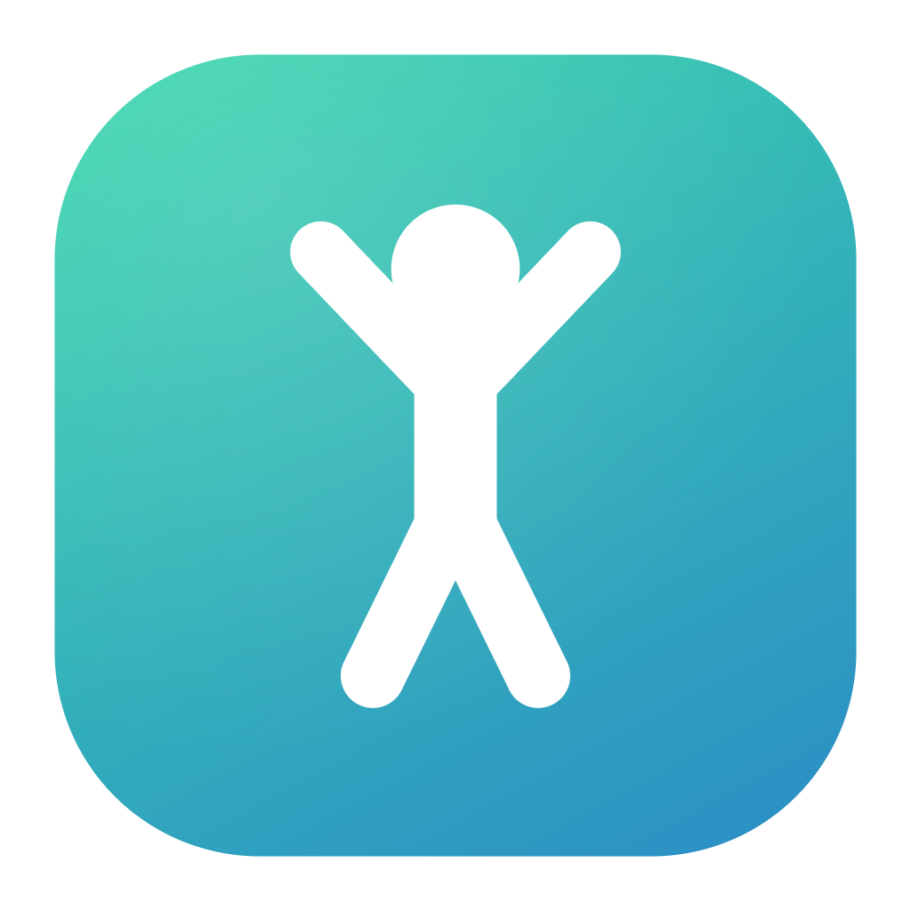

# 站立提醒 · StandUp

一款给 macOS 用的久坐提醒 + 打卡 App。开始计时后，每隔一段时间（默认 1 小时）
会用一段程序合成的悦耳琶音提醒你起身活动，同时在所有显示器上铺一层醒目的全屏提示，
并自动记录你每天的使用日期、使用时长和起身次数。



## 功能

**提醒**
- 每 30 / 45 / 60 / 90 / 120 分钟提醒一次，可自定义
- 悦耳提醒音：C 大调琶音 + 钟琴音色，实时合成，不依赖任何音频文件
- 全屏醒目提醒：毛玻璃卡片 + 呼吸光晕 + 活动倒计时，多显示器同时覆盖
- 系统通知中心推送 + Dock 图标跳动
- 每次提醒会随机给一条具体的活动建议（拉伸、远眺、深蹲……）
- 支持「完成打卡 / 稍后 N 分钟 / 本次跳过」三种响应，回车和 Esc 有快捷键

**打卡与记录**
- 打开即打卡：当天累计使用满 1 分钟就记为一次有效打卡
- 月历热力图：颜色深浅代表当天使用时长，可翻月、可点选查看某天详情
- 每日统计：使用时长、站立时长、提醒次数、完成起身次数、跳过次数
- 连续打卡天数、累计打卡天数、累计起身次数、累计使用时长
- 最近 7 天使用时长柱状图
- 每日起身目标与进度条
- 一键导出 CSV（带 BOM，Excel 打开中文不乱码）

**其他**
- 菜单栏常驻：关掉主窗口后依旧在后台计时，随时查看倒计时、开始/停止
- 浅色 / 深色模式自适应
- 数据以 JSON 存在本地 `~/Library/Application Support/StandUp/store.json`，不联网、不上传
- 电脑睡眠期间不会误计使用时长；唤醒后会立刻补上错过的提醒

> **完全没有编程基础？** 请看 [安装指南.md](安装指南.md)，里面有一步一步的图文说明。

## 系统要求

- macOS 13 (Ventura) 或更高
- Xcode 命令行工具（用于编译）：`xcode-select --install`

## 构建与安装

```bash
git clone <本仓库地址>
cd claude

./build_app.sh            # 编译并打包到 dist/站立提醒.app
./build_app.sh --install  # 顺便复制到 /Applications
./build_app.sh --run      # 打包完直接打开
```

首次打开时若提示「无法验证开发者」，**右键点击 App → 打开 → 再点一次「打开」**即可
（因为这是本地临时签名，不是 App Store 分发的应用）。

### 开机自启

系统设置 → 通用 → 登录项 → 点 `+` 把「站立提醒」加进去。

## 使用

1. 打开 App，点 **开始久坐提醒** —— 今天就算打卡了，倒计时开始
2. 到点后会响铃并弹出全屏提醒，站起来活动一下
3. 活动完点 **我已起身，完成打卡**（或等倒计时走完自动完成），下一轮计时自动开始
4. 切到 **记录** 标签页可以看日历、历史和累计统计
5. 关掉窗口不影响计时，菜单栏图标里随时能看到剩余时间

## 项目结构

```
Package.swift               SwiftPM 配置（可执行目标，macOS 13+）
build_app.sh                编译 + 打包成 .app 的脚本
Scripts/make_icon.py        用纯 Python 生成 App 图标（SDF 抗锯齿 + 手写 PNG）
Resources/AppIcon.png       生成出来的 1024×1024 图标
Sources/StandUp/
  StandUpApp.swift          App 入口、菜单栏面板、AppDelegate
  AppState.swift            核心状态机：计时、提醒调度、打卡统计
  Models.swift              数据模型与格式化工具
  Storage.swift             JSON 持久化（原子写入 + 损坏备份）与 CSV 导出
  ChimePlayer.swift         提醒音合成（AVAudioEngine + 加法合成）
  NotificationManager.swift 系统通知封装
  OverlayController.swift   全屏提醒窗口管理（多显示器）
  Theme.swift               配色、卡片、按钮样式
  Views/
    ContentView.swift       主框架与标签栏
    DashboardView.swift     「今天」页
    HistoryView.swift       「记录」页：月历热力图 + 统计
    SettingsView.swift      「设置」页
    OverlayView.swift       全屏提醒界面
    Components.swift        进度环、柱状图、统计卡片等通用组件
```

## 数据格式

`~/Library/Application Support/StandUp/store.json`

```json
{
  "version": 1,
  "settings": { "intervalMinutes": 60, "standSeconds": 300, "dailyGoal": 8, ... },
  "records": {
    "2026-08-17": {
      "day": "2026-08-17",
      "activeSeconds": 14400,
      "standSeconds": 1500,
      "remindersFired": 4,
      "standUpsCompleted": 4,
      "standUpsSkipped": 0
    }
  }
}
```

想换台电脑继续用，把这个文件拷过去就行。
